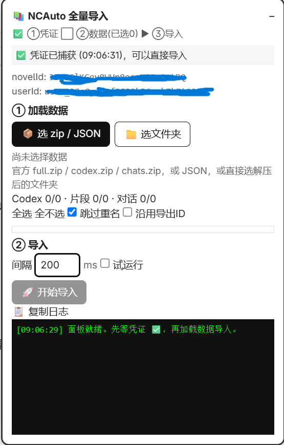
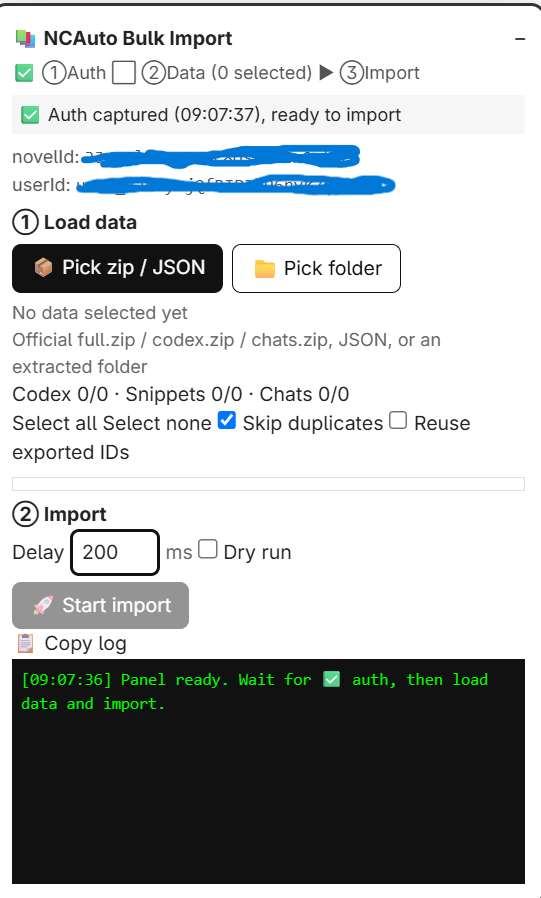

# NCAuto — Unofficial Bulk Importer for NovelCrafter

[中文版](README.zh-CN.md) · [Technical notes](docs/technical.md)

NovelCrafter provides official data exports (ZIP archives) but no corresponding
import function. NCAuto closes this gap by writing the contents of an official
export back into a target book in a single pass, covering **Codex entries
(body, research notes, relationships, aliases, tags), Snippets, and Chats**.
The panel UI follows the browser locale: Chinese on `zh-*` browsers, English
otherwise.

| Chinese UI | English UI |
|---|---|
|  |  |

## Features

- **Codex migration**: entry bodies, research notes, inter-entry relationships,
  aliases, tags, and colors are preserved.
- **Snippet migration**: plain-text bodies are converted to ProseMirror/Tiptap
  document format automatically.
- **Chat migration**: messages are re-segmented by `## User / ## AI` headings
  and rebuilt as message threads.
- **Pre-import permission check**: the import is blocked before any write if
  the current account lacks write access to the target book.
- **Duplicate skipping**: Codex entries are matched by name, Snippets and
  Chats by title; existing items are never modified.
- **Dry-run mode**: parses and previews without issuing any write request.
- **Draggable, minimizable panel** with automatic position persistence.

## Installation

1. Install the [Tampermonkey](https://www.tampermonkey.net/) browser extension.
2. Create a new userscript in Tampermonkey and paste the entire contents of
   `ncauto.user.js` into it, then save.
3. Open a book owned by the current account
   (URL format: `app.novelcrafter.com/novels/xxxx/...`). The import panel
   appears in the upper-right corner.

The script runs exclusively under `https://app.novelcrafter.com/novels/*`.
No credentials are required; it reuses the existing authenticated browser
session.

## Usage

### Step 1 — Wait for authentication

On first load the panel reports that it is waiting for credentials. Interact
with the page (e.g., open any Codex entry) until the status changes to
authenticated. The import button remains disabled until this step completes.

### Step 2 — Load data

Select `Pick zip / JSON` or `Pick folder`. Supported inputs:

| Input | Description |
|---|---|
| Official `full.zip` | Full project export containing Codex, Snippets, and Chats |
| Official `codex.zip` / `chats.zip` | Single-category exports |
| Extracted folder / `codex_import.json` | A decompressed export, or JSON produced by `tools/parse_codex_export.py` |

### Step 3 — Select entries and dry-run

1. Entries are grouped by Codex / Snippets / Chats and can be selected per
   group or individually.
2. Enable `Dry run` and start the import to inspect the parsed results in the
   log (no requests are issued).
3. After verification, import 1–2 entries for validation, confirm them in the
   book, then proceed with the full batch.

### Step 4 — Full import and verification

Disable `Dry run`, start the import, and **refresh the page** afterwards to
verify the item counts (the sidebar cache is not updated in real time; the
completion log is authoritative).

## Options

| Option | Default | Description |
|---|---|---|
| Skip duplicates | On | Existing entries with identical names/titles are skipped and never modified |
| Reuse exported IDs | Off | Enable when importing an export from the same account for exact relationship mapping; disable and retry if a 403 error occurs with another account's export |
| Delay (ms) | 200 | Interval between writes (plus random jitter); increase on HTTP 429 or mass failures |
| Dry run | Off | Parse and preview only; no write requests are issued |

## FAQ

**The panel keeps waiting for credentials.**
Interact with the page further. The script captures credentials passively from
the application's own network requests.

**`novelId` is not detected.**
Confirm that a page inside a book is open and that the URL contains
`/novels/xxx/`.

**HTTP 403 FORBIDDEN.**
Possible causes: (1) signed in to the wrong account; (2) the book was shared
read-only; (3) exported IDs from another account's export were reused —
disable “Reuse exported IDs” and retry a single entry.

**Sidebar counts are unchanged after import.**
Refresh the page first. Entries are written once the log reports completion;
the sidebar is not refreshed in real time.

**The log reports dropped relationships.**
Expected behavior. A relationship is dropped and counted when its target is
neither part of the current batch nor present in the book under the same name.

**Duplicate Snippets/Chats after re-import.**
Official exports retain only the first 8 characters of their IDs, so new IDs
must be generated on import. Enable “Skip duplicates” to deduplicate by title.

**Mass HTTP 4xx failures.**
The most likely cause is an upstream site update that changed the private API.
File an issue with a redacted log (remove JWT, userId, novelId beforehand).
Protocol details are documented in `docs/technical.md`.

## How it works

Web pages are a presentation layer over APIs. The script issues no
credential handling and stores no passwords; using the authenticated session,
it replays the same `data.commit` / `data.updateOne` (tRPC) requests that the
official site issues when creating entries manually. The complete reverse
engineering record is available in [`docs/technical.md`](docs/technical.md).

## Repository contents

| File | Description |
|---|---|
| `ncauto.user.js` | Primary userscript (v0.4.0: Codex + Snippets + Chats) |
| `docs/technical.md` | Endpoint inventory, message formats, and test records |
| `docs/screenshot-zh.png` / `screenshot-en.png` | Panel screenshots |
| `tools/parse_codex_export.py` | Optional converter: official export to generic import JSON |

## Acknowledgments

Snippet/Chat message formats and export structure analysis reference third-party
`ncauto` research (`NOTES.md` plus the `ncimport*.mjs` series). The zero-install
Tampermonkey implementation is original to this project.

## Disclaimer

- Unofficial tooling, not affiliated with NovelCrafter.
- Relies on undocumented interfaces with no stability guarantees; upstream
  changes may break it at any time.
- Write exclusively to books the operator has write access to. Operators are
  responsible for compliance with the NovelCrafter Terms of Service; use at
  your own risk.
- Redact all sensitive material (JWT, userId, novelId, private book titles)
  before filing issues or sharing screenshots.

## License

MIT — see [LICENSE](LICENSE).
